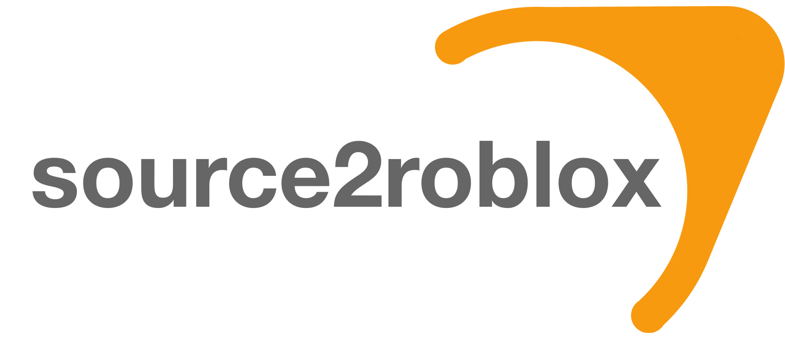
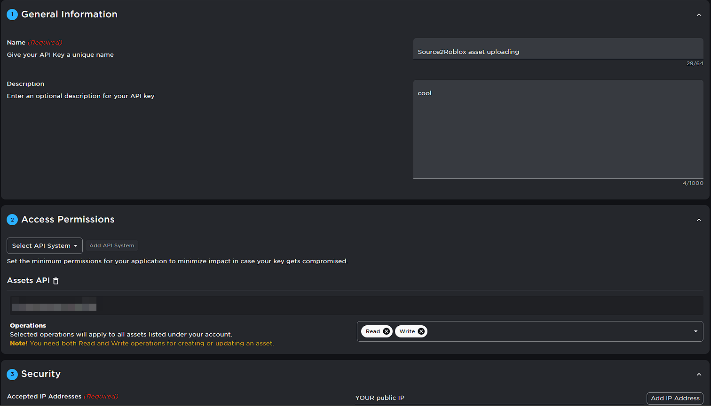
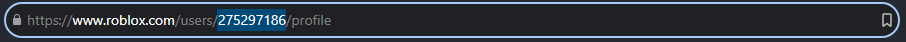

## ⚠️ Disclaimer
This project will no longer being maintained due to misuse by bad actors. This is intended as a reference and showcase of technical feat, nothing more. Do not use this code to rip levels for use in monetized experiences without explicit permission to use them on Roblox!

## ❓ About

Source2Roblox is a super cool C# console application originally created by MaximumADHD that can:
- Rip data from Valve's game files (*.VPK, *.VMT, *.VTF, *.BSP)
- Compile that data into files that Roblox can utilize (*.RBXM, *.RBXL, *.MESH, *.PNG)

This program is not very user-friendly, but if you want to take up the challenge, you can attempt to get S2R up and running!

## 🗜️ Setup

1. Download and run [Roblox Studio Mod Manager](https://github.com/MaximumADHD/Roblox-Studio-Mod-Manager)

2. Install [Visual Studio 2019](https://my.visualstudio.com/Downloads?q=visual%20studio%202019&wt.mc_id=o~msft~vscom~older-downloads) along with the [workloads](https://learn.microsoft.com/en-us/visualstudio/install/modify-visual-studio?view=vs-2019) `Visual C#` and `.NET Framework 4.8`

3. Install [Git](https://git-scm.com/downloads)

4. Create a directory for you to clone your repositories in using File Explorer

5. Copy that directory path to your clipboard

6. Open `Command Prompt` on your computer and select that directory by using `cd (directory path)`

7. Next, use `git clone (repository link)` to copy this repository to your computer.

   - https://github.com/Simoxus/source2roblox

8. Go to the Source2Roblox repository, and open the file that ends with (*.SLN) in Visual Studio 2019   

9. Leave it in the background for now (we'll need it later)

### 🔑 Creating the API Key

1. Go to [Creator Hub](https://create.roblox.com/).

2. Go to `Open Cloud`, a button on the left side menu of your screen.

3. Go to `API Keys`.

4. Create a new `API key`.

5. Make sure your API key's configuration looks like this:

**You can change the name and description, and retrieve your public IP by going to [WhatIsMyIP](https://www.whatismyip.com/)**

6. Create your key and copy it to your clipboard 

7. Open the `Visual Studio` app we left in the background earlier

8. Navigate to `Solution Explorer`, and look until you find a folder called `Util`. 

9. Open that folder and open `AssetManager.cs`. This is where you will put your essential asset uploading information.

10. Paste your API key into the variable with the name `apikey`

11. Keep this script open.

### 🧑 Getting your User ID

1. Go to your `Profile` on Roblox

2. Where the URL on your screen is, copy the large string of numbers to your clipboard. **(It should look like this)**
 

3. Go back to Visual Studio, and paste your User ID into the variable called `userId`.

### 🍪 Getting your ROBLOSECURITY Cookie

**You can mute the slightly obnoxious music**

<iframe width="560" height="315" src="https://www.youtube.com/embed/eUd47kPxZvQ?si=NIJLAMYkLT2PC5Cd" title="YouTube video player" frameborder="0" allow="accelerometer; autoplay; clipboard-write; encrypted-media; gyroscope; picture-in-picture; web-share" allowfullscreen></iframe>

1. Make sure your token is copied to your clipboard, and you can then go back to Visual Studio and paste your token into the variable called `ROBLOX_TOKEN`

2. Exit out of this script, and go to the next section.

### ⚙️ Setting your Arguments

1. Go to Solution Manager, and under the first item (Solution), you should find a item with a C# logo and the name `Source2Roblox`. Right-click on it, and select `Properties`.

2. Make sure your target framework in `Application` is set to `.NET Framework 4.8`.

3. Go to the Debug tab, and `Command line arguments` is where you can enter the parameters you want. They are listed below.

| **Argument**                         | **Required?** | **Example**                                                                         |
|--------------------------------------|---------------|-------------------------------------------------------------------------------------|
| `-game "PATH/TO/GAME/FOLDER"`        | Yes           | `-game "C:\Program Files (x86)\Steam\steamapps\common\Half-Life 2\hl2"`             |
| `-model "path/to/local/model.mdl"`   | No            | `-model` for real-time model searching, `-model gman_high` for a specific model |
| `-vtf "path/to/local/image.vtf"`     | No            | `-vtf "editor/obsolete.vtf"`                                                        |
| `-map "map_name"`                    | No            | `-map d1_trainstation_01`                                                           |
| `-upload`                            | No            | `-upload`                                                                           |
| `-noPrompt`                          | No            | `-noPrompt`                                                                         |

With the command line arguments set, press the `Debug` button to run the program and have it work some magic 🪄

## 📄 File Generation

- PNG files generated from `-vtf` will be sent to a new folder on your desktop called `ExamineVTF`
- OBJ/MTL files generated from `-map` will be sent to a new folder on your desktop called `SourceMaps`
- OBJ/MTL files generated from `-model` will be sent to a new folder on your desktop called `SourceModels`
- RBXL/RBXM/PNG files generated from either `-map` or `-model` will be sent to `%localappdata%\Roblox Studio\content\source`.

## 💡 Troubleshooting

### ⚠️ Warnings

   📦 Nuget Packages

   1. Go to `Solution Explorer`, and right-click on the first item (Solution)
   2. Restore `NuGet Packages`

### ❌ Errors

 Make sure you have rebuilt the Nuget Packages.

 You should not be getting errors unless you have entered invalid arguments or have made a typo in one of the scripts.
 If you are unable to fix it, please reattempt the 🗜️ Setup.

### 🆕📦 Downloading New Packages

 Sometimes, you may get errors and warnings about missing packages. What fixed this for me on a new computer was going to `Manage Nuget Packages` in my Solution Manager, going to `Browse`, and downloading

     Newtonsoft.Json.Bson,
     Newtonsoft.Json.Schema,
     Microsoft.AspNetCore.Mvc.NewtonsoftJson

## 📋 Credits

**Original**: [@MaximumADHD](https://www.roblox.com/users/2032622/profile) (🐐)

**Documentation**: [@luaorient](https://www.roblox.com/users/275297186/profile)

**Patches**: [@IVIICHAELxx](https://www.roblox.com/users/268500894/profile),
             [@luaorient](https://www.roblox.com/users/275297186/profile)

